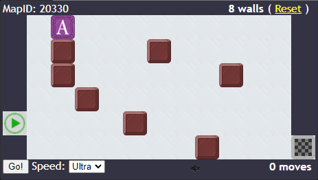
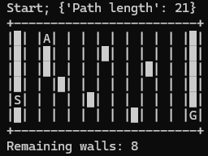
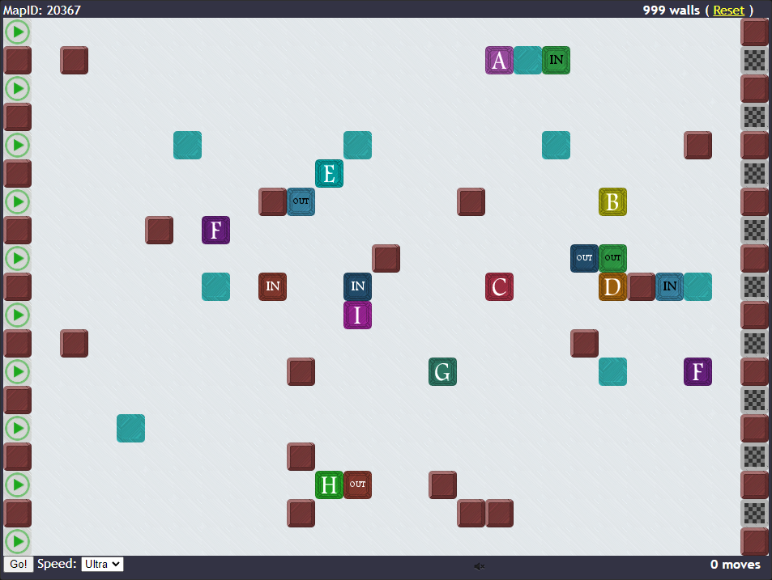
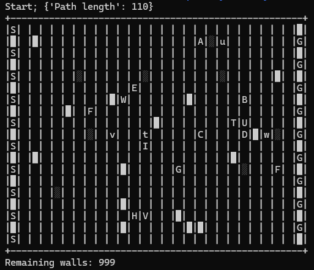

# Pathery Gymnasium Environment

This is a Gymnasium environment for the game [Pathery](https://www.pathery.com/home).

## Simple Example





## Ultra Complex Unlimited Example





## Definitions

 - Wall - A user-placed blocked square
 - Rock - A pre-existing blocked square

## Installation

To install this environment locally, run the following commands:

```{shell}
cd pathery_env
pip install -e .
```

`-e` Installs a project in editable mode from a local project path. If you do not plan to edit the env, you do not need to use `-e`.

## Fast Pathfinding!

A C++ version of pathfinding comes with this environment (~20x faster). In order to use it, simply do the following (assuming Linux):

```
cd pathery_env/cpp_lib
make
```

This should build a `pathfinding.so` shared library. Upon creation of the Pathery environment in python, this shared library will be loaded. If successful, you will see the following printed:

```
Successfully loaded C++ pathfinding library
```

If there is an error loading the library, you will see an error printed; for example:

```
Failed to load C++ pathfinding library: ".../PatheryEnv/pathery_env/envs/../cpp_lib/pathfinding.so: cannot open shared object file: No such file or directory". Using python pathfinding.
```

In this case, the environment will fallback to pathfinding in Python.