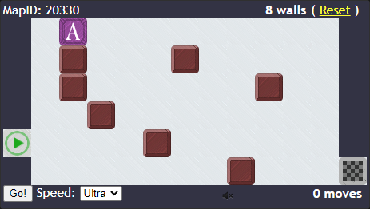
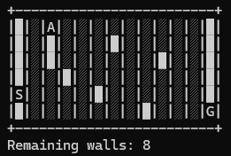

# Pathery Gymnasium Environment

This is a Gymnasium environment for the game [Pathery](https://www.pathery.com/home).





## Definitions

 - Wall - A user-placed blocked square
 - Rock - A pre-existing blocked square

## Installation

To install this environment locally, run the following commands:

```{shell}
cd pathery_env
pip install -e .
```

`-e` Installs a project in editable mode from a local project path. If you do not plan to edit the env, you do not need to use `-e`.