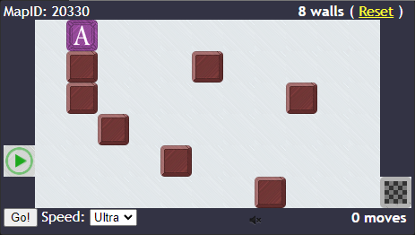
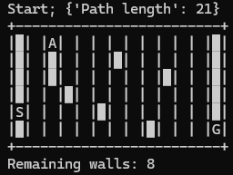
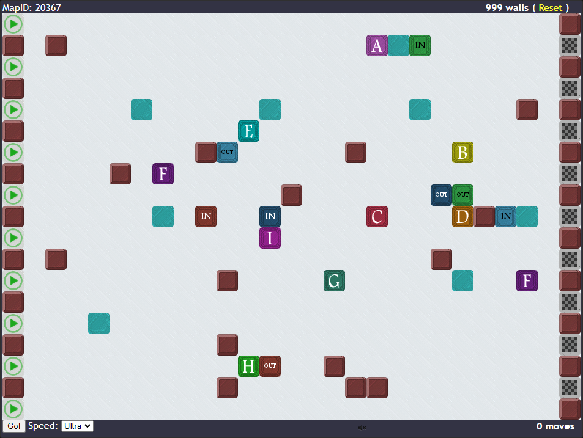
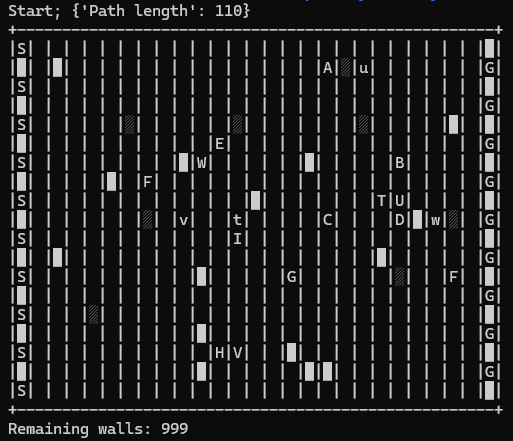

# Pathery Gymnasium Environment

This is a Gymnasium environment for the game [Pathery](https://www.pathery.com/home).

## Simple Example





## Ultra Complex Unlimited Example





## Definitions

 - Wall - A user-placed blocked square
 - Rock - A pre-existing blocked square

## Action Space

The action space is a [`gym.spaces.MultiDiscrete`](https://gymnasium.farama.org/api/spaces/fundamental/#gymnasium.spaces.MultiDiscrete) of shape `(height, width)`. An action in this space represents "place a wall at row, col".

For your model, it may be useful to flatten the observation so that the action space is simply a one-hot over all possible `height*width` cells:

```
import pathery_env.wrappers

env = gym.make('pathery_env/Pathery-RandomNormal', render_mode='ansi')
env = pathery_env.wrappers.FlattenActionWrapper(env)
```

## Observation Space

The observation space is a [`gym.spaces.Dict`](https://gymnasium.farama.org/api/spaces/composite/#gymnasium.spaces.Dict). The default item in the dict is the `"board"` which is a [`gym.spaces.Box`](https://gymnasium.farama.org/api/spaces/fundamental/#gymnasium.spaces.Box) of shape `(cell_type_count, height, width)`. This space represents a one hot for the cell type for each position on the 2d grid.

Like the action space, it may be useful for your model to flatten the observation space. You can do so with [`gym.wrappers.FlattenObservation`](https://gymnasium.farama.org/api/wrappers/observation_wrappers/#gymnasium.wrappers.FlattenObservation).

> TODO: Another thing in the observation dict can be the action mask. If using that, you should not flatten the observation.

## Rewards

The reward is the delta in path length. For example, if the current path length is 12 and a wall is placed that increases the path length to 16, the reward will be 16-12=4.

If a wall is placed in an invalid position (like on top of another wall, or on the start position, etc.), the reward is 0 and the episode is terminated.

If a wall is placed that blocks the path, a reward of -1 is returned and the episode is terminated.

## Installation

To install this environment locally, run the following commands:

```{shell}
cd pathery_env
pip install -e .
```

`-e` Installs a project in editable mode from a local project path. If you do not plan to edit the env, you do not need to use `-e`.

## Usage

```
import pathery_env

mapString = '13.6.8.Simple...1727582400:,r3.11,f1.,r3.11,r3.,s1.11,r3.,r3.1,r1.2,r1.1,r1.4,r3.,r3.5,c1.5,r3.,r3.2,r1.8,r3.'
env = gym.make('pathery_env/Pathery-FromMapString', render_mode='ansi', map_string=mapString)
```

## Fast Pathfinding!

A C++ version of pathfinding comes with this environment (~20x faster). In order to use it, simply do the following (assuming Linux):

```
cd pathery_env/cpp_lib
make
```

This should build a `pathfinding.so` shared library. Upon creation of the Pathery environment in python, this shared library will be loaded. If successful, you will see the following printed:

```
Successfully loaded C++ pathfinding library
```

If there is an error loading the library, you will see an error printed; for example:

```
Failed to load C++ pathfinding library: ".../PatheryEnv/pathery_env/envs/../cpp_lib/pathfinding.so: cannot open shared object file: No such file or directory". Using python pathfinding.
```

In this case, the environment will fallback to pathfinding in Python.